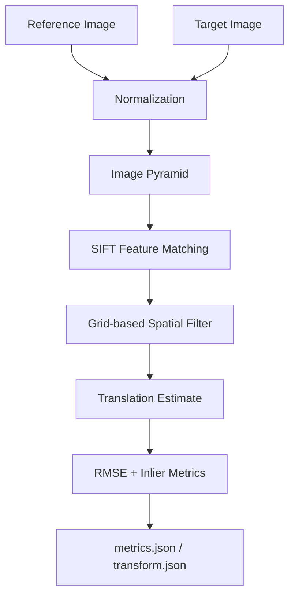
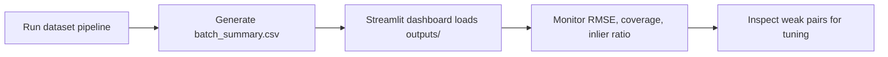
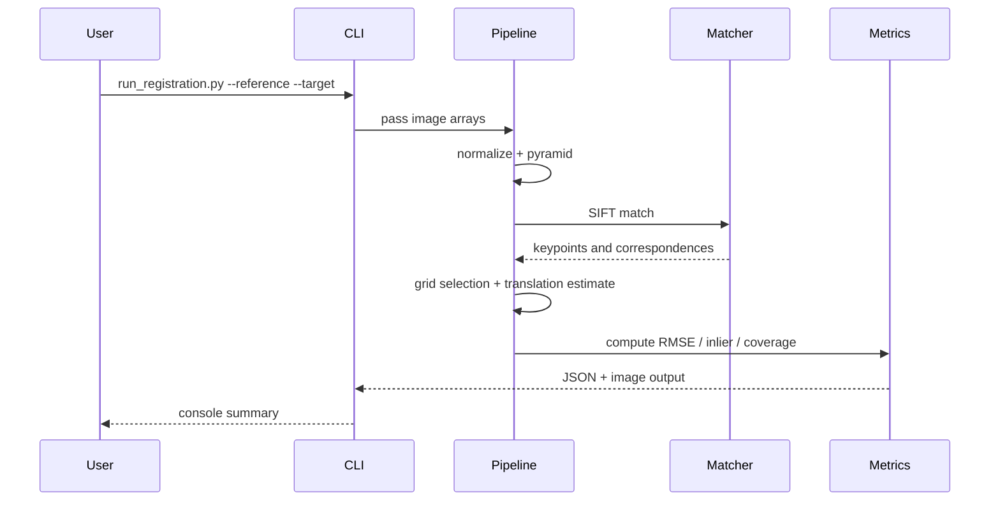

# 🌙 LUNAR-ALIGN

## Physics-Guided Multimodal Lunar Registration

LUNAR-ALIGN is a lunar image-registration prototype designed around a very practical research goal: align overlapping lunar scenes from different sensors and resolutions, then quantify how trustworthy the alignment is using geometric evidence such as RMSE, coverage, and inlier ratio.

This repository preserves the valuable Chandrayaan-2 ingestion and overlap-preprocessing work while shifting the core objective away from super-resolution and toward robust matching and registration.

> The current implementation is intentionally simple and interpretable: normalize images, build a coarse pyramid, detect feature matches, enforce spatial coverage, and output registration metrics.

---

## 1) Why this project exists

Lunar data is hard because scenes differ across:

- sensor modality,
- illumination conditions,
- resolution and scale,
- terrain texture and crater density,
- overlap quality,
- perspective and local deformation.

A single matcher is not enough. The architecture is built to combine preprocessing, feature extraction, spatially balanced matching, and quantitative evaluation.

The real product is not just a transformed image, but a measured alignment result:

- is there enough evidence that the images overlap?
- how many matches are geometrically consistent?
- how large is the residual error?
- is the match distribution stable over the field of view?

---

## 2) System overview

The actual repository contains the following core pieces:

- `core/preprocess/normalization.py` — image normalization and masking,
- `core/preprocess/pyramid.py` — multi-scale pyramid generation,
- `core/spatial/grid_selection.py` — spatially distributed match filtering,
- `matchers/sift_baseline/matcher.py` — feature matching baseline,
- `core/registration/pipeline.py` — end-to-end registration pipeline,
- `scripts/run_registration.py` — command-line runner,
- `scripts/run_dataset.py` — batch runner over many image pairs,
- `dashboard.py` — Streamlit dashboard for tracking performance.

### High-level architecture



### More visual interpretation

```text
                         ┌─────────────────────┐
                         │  Lunar scene pair   │
                         │  (reference, target)│
                         └──────────┬──────────┘
                                    │
                                    ▼
                    ┌──────────────────────────────────┐
                    │  Preprocessing + normalization   │
                    │  contrast, masking, grayscale     │
                    └──────────┬───────────────────────┘
                               │
                               ▼
                    ┌──────────────────────────────────┐
                    │    Multi-scale pyramid build      │
                    │   detect coarse-to-fine overlap   │
                    └──────────┬───────────────────────┘
                               │
                               ▼
                    ┌──────────────────────────────────┐
                    │  Feature matching (SIFT baseline)│
                    │  descriptor + nearest-neighbor   │
                    └──────────┬───────────────────────┘
                               │
                               ▼
                    ┌──────────────────────────────────┐
                    │  Spatially distributed filtering │
                    │  4x4 grid, max per cell          │
                    └──────────┬───────────────────────┘
                               │
                               ▼
                    ┌──────────────────────────────────┐
                    │  Translation estimation          │
                    │  mean shift between matched pts │
                    └──────────┬───────────────────────┘
                               │
                               ▼
                    ┌──────────────────────────────────┐
                    │   Metrics: RMSE, inlier ratio,  │
                    │   coverage, runtime, matcher    │
                    └──────────────────────────────────┘
```

---

## 3) Repository structure

```text
LUNAR-ALIGN/
├── core/
│   ├── geometry/
│   │   └── haversine.py
│   ├── preprocess/
│   │   ├── normalization.py
│   │   └── pyramid.py
│   ├── registration/
│   │   └── pipeline.py
│   └── spatial/
│       └── grid_selection.py
├── matchers/
│   └── sift_baseline/
│       └── matcher.py
├── scripts/
│   ├── run_registration.py
│   └── run_dataset.py
├── configs/
│   └── default.yaml
├── tests/
│   └── test_pipeline.py
├── legacy/
│   └── ... historical super-resolution work
├── README.md
├── dashboard.py
├── coordinates_ohrc.csv
├── coordinates_tmc2.csv
├── new_map.py
├── pytest.ini
└── LICENSE
```

### What each module does

#### `core/preprocess/normalization.py`
Normalizes the image data for stable feature matching and removes spurious intensity differences.

#### `core/preprocess/pyramid.py`
Creates a multi-resolution image pyramid to support scale-aware matching and coarse alignment.

#### `core/spatial/grid_selection.py`
Selects feature matches that are spread across the image instead of clustered in a single region.

This is important because a dense local cluster does not prove global alignment.

#### `matchers/sift_baseline/matcher.py`
Implements a SIFT-based matcher with a template fallback when feature matching fails.

#### `core/registration/pipeline.py`
Coordinates the entire sequence:

1. normalize reference and target,
2. compute scene statistics,
3. match features,
4. filter for spatial coverage,
5. estimate a simple translation transform,
6. compute metrics,
7. save JSON + visualization output.

---

## 4) Pipeline mathematics

This system is built around a simple but meaningful estimation model.

### 4.1 Feature matching
Let the reference image be $I_r$ and the target image be $I_t$. The matcher produces corresponding keypoint sets:

$$
\{(x_i^r, y_i^r)\}_{i=1}^N \quad \text{and} \quad \{(x_i^t, y_i^t)\}_{i=1}^N
$$

A match is accepted only if geometric and spatial constraints are satisfied.

### 4.2 Translation estimate
For each matched pair, the displacement is:

$$
\Delta x_i = x_i^t - x_i^r, \qquad \Delta y_i = y_i^t - y_i^r
$$

The pipeline estimates a global translation using the average displacement:

$$
\hat{t}_x = \frac{1}{N}\sum_{i=1}^N \Delta x_i,
\qquad
\hat{t}_y = \frac{1}{N}\sum_{i=1}^N \Delta y_i
$$

This is a coarse alignment model, which matches the current implementation in `core/registration/pipeline.py`.

### 4.3 RMSE
The residual error for each pair is:

$$
 e_i = \sqrt{(\Delta x_i - \hat{t}_x)^2 + (\Delta y_i - \hat{t}_y)^2}
$$

and the overall registration error is:

$$
RMSE = \sqrt{\frac{1}{N}\sum_{i=1}^N e_i^2}
$$

This is exactly the metric that is computed in the pipeline.

### 4.4 Inlier ratio
In the current project implementation, the pipeline uses a simplified inlier description, returning:

$$
\text{Inlier Ratio} = 1.0
$$

when the match set is accepted, because the code path is designed for a lightweight prototype and the data are not yet passed through a robust estimator such as RANSAC/MAGSAC. In a more advanced version, this would be computed as:

$$
\text{Inlier Ratio} = \frac{\#\{\text{accepted geometrically consistent matches}\}}{\#\{\text{all candidate matches}\}}
$$

This is the metric that matters for trust in registration.

### 4.5 Spatial coverage
The grid-based filtering ensures matches are distributed across the image. Coverage is estimated in terms of how many grid cells contain at least one valid match. If the match distribution is too clustered, the fit is unstable.

This is a direct defense against overfitting to one crater-rich or texture-rich region.

---

## 5) What the system outputs

Each run creates outputs in the selected output folder, for example:

```text
outputs/
├── metrics.json
├── transform.json
```

### `metrics.json`
Contains values such as:

```json
{
  "rmse": 3.1456,
  "inlier_ratio": 1.0,
  "spatial_coverage": 0.75,
  "runtime": 0.52,
  "matcher": "SIFT",
  "scene": {
    "texture": 18.2,
    "entropy": 16.9,
    "scale_ratio": 1.0,
    "illumination_gap": 6.7
  }
}
```

### `transform.json`
Stores the estimated translation vector:

```json
{
  "translation_x": 12.0,
  "translation_y": -7.0,
  "method": "translation_estimate"
}
```

> At this stage, the repository is focused on metric generation and pipeline benchmarking rather than publishing visual registration screenshots from real mission data.

---

## 6) Running the pipeline on an image pair

### Single pair execution

```bash
python scripts/run_registration.py \
  --reference path/to/reference_image.png \
  --target path/to/target_image.png \
  --output-dir outputs/example_run
```

### Supported inputs
The loader accepts:

- `.png`
- `.jpg`
- `.tif`
- `.npy`
- `.npz`

The code in `scripts/run_registration.py` automatically loads the array, image, or compressed NumPy payload.

---

## 7) Running through a dataset

A batch dataset runner is included at `scripts/run_dataset.py`.

Create a CSV manifest like this:

```csv
pair_id,reference,target
pair_001,images/reference_001.png,images/target_001.png
pair_002,images/reference_002.png,images/target_002.png
pair_003,images/reference_003.png,images/target_003.png
```

Then run:

```bash
python scripts/run_dataset.py \
  --manifest dataset_manifest.csv \
  --output-dir outputs/dataset
```

This generates:

```text
outputs/dataset/
├── pair_001/
│   ├── metrics.json
│   └── transform.json
├── pair_002/
│   └── ...
├── batch_summary.csv
```

The summary file includes:

- `pair_id`
- `reference`
- `target`
- `rmse`
- `inlier_ratio`
- `coverage`
- `runtime`
- `matcher`

This lets you benchmark the system across a whole dataset, not just one pair.

---

## 8) Recommended datasets for this pipeline

For this project, the recommended primary source is the SELENE/Kaguya mission dataset, because it provides lunar imagery with compatible orbital context and overlapping coverage suitable for registration experiments.

### Primary recommendation: SELENE (Kaguya)

Use the SELENE mission products for the core benchmark and evaluation set, especially:

- SELENE Terrain Camera (TC) imagery for lunar surface texture and overlap structure,
- SELENE Multi-band Imager (MI) data for cross-sensor and radiometric comparison,
- SELENE Laser Altimeter (LALT) and associated geometric metadata where available,
- Kaguya-derived orthorectified products or reduced-resolution scene pairs for controlled overlap evaluation.

These products are suitable for:

- pair construction across overlapping lunar regions,
- testing robustness to illumination and terrain differences,
- benchmarking inlier ratio, coverage, and RMSE,
- measuring how well a matcher generalizes across orbital imagery.

### Recommended data sources

- JAXA SELENE/Kaguya archive and public data products
- NASA PDS archive entries associated with SELENE mission products
- lunar orbital image repositories hosting Kaguya/SELENE terrain and multi-spectral products

### Practical dataset strategy

1. Choose overlapping SELENE image pairs with known footprint overlap.
2. Extract a small, controlled subset for baseline benchmarking.
3. Create a CSV manifest for the pair list.
4. Run the registry pipeline over the selected pairs.
5. Compare results by RMSE, inlier ratio, and spatial coverage.

This gives a clean and reproducible benchmark without requiring a real-world mission deployment in the prototype stage.

---

## 9) Dashboard for tracking model performance

A lightweight monitoring dashboard is included in `dashboard.py`.

### Run the dashboard

```bash
streamlit run dashboard.py
```

### What the dashboard shows

- mean RMSE,
- mean inlier ratio,
- mean spatial coverage,
- mean runtime,
- pair-wise table of results,
- line chart of inlier ratio by pair,
- bar chart of RMSE by pair.

### Live usage pattern



This is a practical way to track whether a new matcher, preprocessing variant, or dataset crop improves real-world performance.

---

## 10) Example workflow in one glance



---

## 11) Scientific and engineering note

This is a research-oriented prototype, not a production-grade photogrammetry system. The code intentionally keeps the pipeline transparent and explainable.

Current strengths:

- clear modular structure,
- easy to inspect and debug,
- measurable outputs,
- dataset-friendly evaluation loop,
- strong baseline for comparing new matchers.

Current limitations:

- translation model is basic,
- inlier ratio is simplified in this implementation,
- robust outlier rejection is not yet fully formalized,
- no full MAGSAC or homography refinement pipeline is included yet.

---

## 12) Next research directions

Potential improvements for the next version include:

- RANSAC/MAGSAC robust geometric validation,
- full affine or homography estimation,
- learned matching methods (LoFTR, LightGlue, DISK, RIFT),
- metadata-driven sensor calibration,
- thermal and illumination-aware normalization,
- richer dataset benchmarking and leaderboards,
- web dashboard with trend analysis and deployment metrics.

---

## 13) Legacy context

This repository originally came from a Chandrayaan-2 and lunar image-processing workflow. The old super-resolution-focused path still exists under `legacy/` and is intentionally not the main active execution path.

The active direction is now registration, validation, and performance monitoring.

---

## 14) Quick start

```bash
python3 -m venv .venv
. .venv/bin/activate
python -m pip install -U pip
python -m pip install numpy pillow opencv-python-headless scipy pyyaml pandas matplotlib pytest streamlit

python scripts/run_registration.py --reference your_ref.png --target your_target.png --output-dir outputs/demo
streamlit run dashboard.py
```
